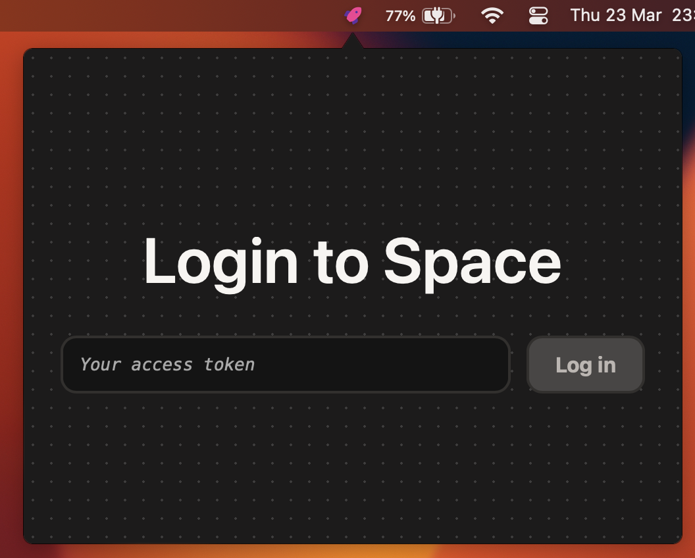
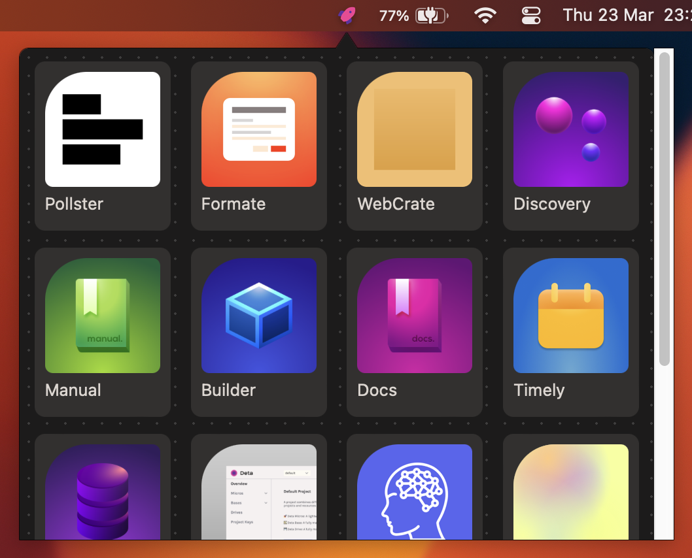
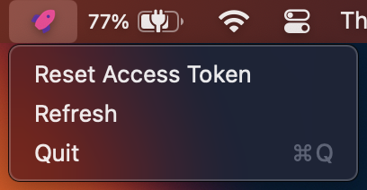

<div align="center">
  <br>
    <a href="https://liftoff.aarush.dev">
      
    </a>
    <h2>Quick launch your Deta Space apps</h2>
    <a href="https://github.com/aarushthukral/liftoff/releases/latest">Download</a>
  <br>
  <br>
  
  
  
</div>

## Development

### Requirements

- NodeJS
- Rust

```sh
yarn install
yarn tauri dev
```

## Attributions

- [Tauri Menubar App by 4gray](https://github.com/4gray/tauri-menubar-app)
- [Deta Space Client by pomdtr](https://github.com/pomdtr/deta-space-client)
- [Teletype by SlumberDemon](https://github.com/SlumberDemon/teletype)

## License

Distributed under the MIT License. See [`LICENSE`](LICENSE) for more information.

For any queries, contact [liftoff@aarush.dev](mailto:liftoff@aarush.dev)
